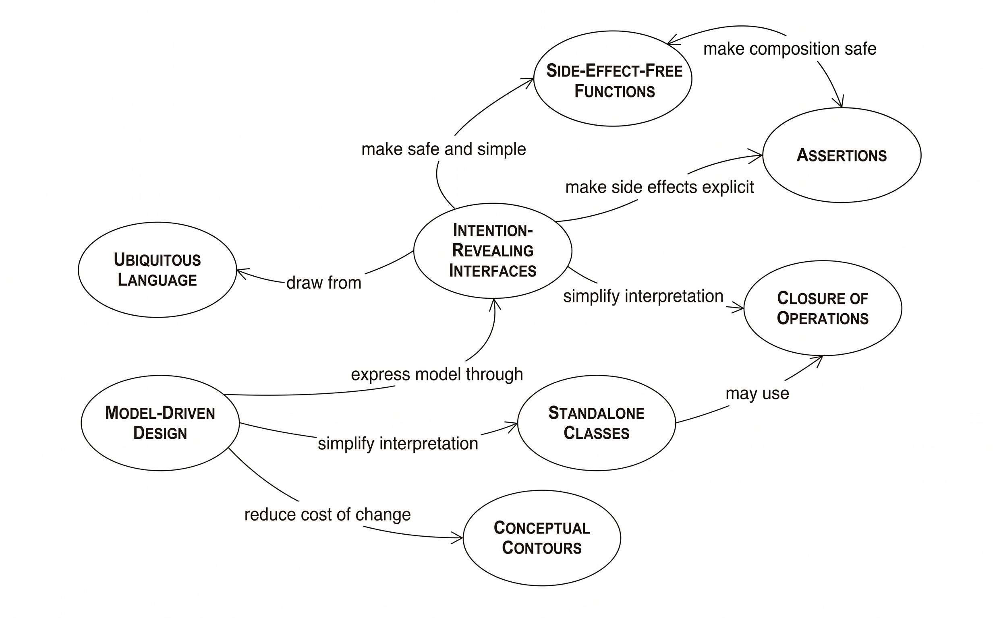
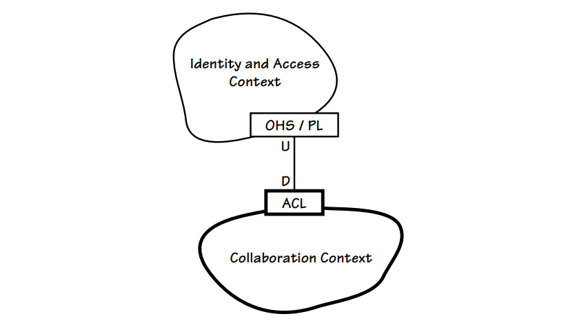

# Domain-Driven Design
Demonstrate DDD strategic and tactical design.  

Why calling it strategic and tactical design?  

In military terms, strategy is the big-picture planning: which battles to fight, where to commit your forces, what the overall objective is. Tactics are the on-the-ground execution: how a unit actually maneuvers and fights to win the specific engagement in front of it. Strategy is what and where; tactics are how.  

Evans mapped this directly onto domain modeling. Strategic design covers the system-wide, coarse-grained, long-lived decisions — where to draw bounded context boundaries, how contexts and teams relate (the context map, ACL, shared kernel), and which subdomain is your core and therefore deserves your best modeling effort. Tactical design is the hands-on, in-the-trenches work of building a model once you're inside a boundary: the concrete code-level building blocks like entities, value objects, aggregates, repositories. They're the tools you reach for to actually implement the model, the same way tactics are what you use to win the battle you're currently in.

# Table of Contents

- [References](#references)
- [Tactical Design Patterns](#tactical-design-patterns)
  - [The Building Blocks](#the-building-blocks)
    - [Entities](#entities)
    - [Value Objects](#value-objects)
    - [Aggregates](#aggregates)
    - [Domain Events](#domain-events)
    - [Repository Pattern](#repository-pattern)
    - [Domain Services](#domain-services)
    - [Specification Pattern](#specification-pattern)
    - [Factory Pattern](#factory-pattern)
    - [Enumeration Pattern](#enumeration-pattern)
  - [Supple Design Patterns](#supple-design-patterns)
    - [Intention-Revealing Interfaces](#intention-revealing-interfaces)
    - [Side-Effect-Free Functions](#side-effect-free-functions)
    - [Assertions](#assertions)
    - [Conceptual Contours](#conceptual-contours)
    - [Standalone Class](#standalone-class)
    - [Closure of Operations](#closure-of-operations)
- [Strategic Design](#strategic-design)
  - [Ubiquitous Language](#ubiquitous-language)
  - [Bounded Contexts](#bounded-contexts)
    - [How to identify bounded context?](#how-to-indentify-bounded-context)
      - [Aligning with Subdomains](#aligning-with-subdomains-problem-space-vs-solution-space)
      - [Tracking an Object's Life Cycle Stages](#tracking-an-objects-life-cycle-stages)
      - [Departmental and Work Group Divisions](#departmental-and-work-group-divisions)
      - [Using Event Storming](#using-event-storming)
    - [The same real-world thing, modelled differently in each context](#the-same-real-world-thing-modelled-differently-in-each-context)
    - [What happens without bounded contexts — the god class](#what-happens-without-bounded-contexts--the-god-class)
    - [Why bounded contexts exist — the god class and the Big Ball of Mud](#why-bounded-contexts-exist--the-god-class-and-the-big-ball-of-mud)
  - [Context Map](#context-map)
    - [Kind of context map](#kind-of-context-map)
    - [Context map between Order and Payment](#context-map-between-order-and-payment)
    - [Payment and Order as Customer-Supplier](#payment-and-order-as-customer-supplier)

# References

- Evans, Eric. "Domain-Driven Design: Tackling Complexity in the Heart of Software"
- Vernon, Vaughn. "Domain-Driven Design Distilled" & "Implementing Domain-Driven Design"

# Tactical Design Patterns

## The Building Blocks


### Entities

> *"Some objects are not defined primarily by their attributes. They represent a thread of identity that runs through time and often across distinct representations."*
> — Evans, Domain-Driven Design, Ch. 5

An Entity is an object defined by its **identity**, not by the values of its attributes. Two entities are equal if and only if they share the same identity, regardless of how their other properties differ. This identity persists over the lifetime of the object — through state changes, persistence, and reconstitution from storage.

Evans draws a clear contrast: a person is an entity (the same person after a name change), while a seat on an aircraft is a value object (any seat 14A is equivalent to any other 14A on the same flight). Getting this distinction right matters because it determines equality, lifecycle, and how the object is tracked.

**Key characteristics (Evans, Ch. 5):**
- Defined by a unique identity, not attributes
- Identity persists through the full lifecycle — creation, persistence, reconstitution
- Mutable: its attributes may change, but it remains the same object
- Equality is identity-based (`Id == other.Id`), not structural

**In this codebase** — `Entity<TId>` is the base class for all entities. It enforces identity-based equality and carries the domain event collection:

```csharp
// BuildingBlocks/Entity.cs
public abstract class Entity<TId>
{
    public TId Id { get; protected set; }

    public override bool Equals(object? obj)
    {
        if (obj is not Entity<TId> other) return false;
        if (GetType() != other.GetType()) return false;
        return Id.Equals(other.Id);   // identity, not attributes
    }
}
```

`Order` and `OrderItem` are both entities. An `Order` changes status, gains items, gets submitted and paid — yet it remains the same `Order` throughout because its `OrderId` never changes:

```csharp
// Order.Domain/Aggregates/OrderAggregate/Order.cs
public class Order : AggregateRoot<OrderId>
{
    public OrderStatus Status { get; private set; }   // mutable
    public DateTime? PaidAt { get; private set; }     // mutable
    // Id never changes — it is the identity
}
```

---

### Value Objects

> *"Many objects have no conceptual identity. These objects describe some characteristic of a thing."*
> — Evans, Domain-Driven Design, Ch. 5

A Value Object has no identity. It is defined entirely by its attributes, and two value objects with the same attributes are interchangeable — like a $5 bill: you do not care which physical note you receive, only its denomination. Because value objects have no identity to protect, they should be made **immutable**. Changing a value object's attribute does not modify it — it produces a new one.

Evans lists three essential properties (Ch. 5):
1. **Describes** a characteristic or measurement, not a thing with a lifecycle
2. **Immutable** — no setters; all attributes are set at construction and never changed
3. **Conceptual whole** — all attributes together express a single concept; no attribute is meaningful in isolation (`Amount` without `Currency` is meaningless)

Vernon adds a practical rule: when in doubt, prefer value objects over entities. They are simpler to reason about, easier to test, safe to share and cache, and carry no persistence overhead.

**In this codebase** — `Money` is the canonical value object. It wraps `Amount` and `Currency` together as a conceptual whole, is fully immutable, and uses attribute-based equality:

```csharp
// Order.Domain/ValueObjects/Money.cs
public class Money : ValueObject
{
    public decimal Amount { get; }    // getter-only — immutable
    public string Currency { get; }  // getter-only — immutable

    public Money(decimal amount, string currency) { ... }  // all state set at construction

    protected override IEnumerable<object?> GetEqualityComponents()
    {
        yield return Amount;    // equality by attributes,
        yield return Currency;  // not by reference
    }
}
```

`Address`, `OrderId`, `CustomerId`, and `Percentage` are all value objects for the same reason — they describe a characteristic and carry no independent lifecycle.

---

### Aggregates

> *"Cluster the entities and value objects into aggregates and define boundaries around each. Choose one entity to be the root of each aggregate, and control all access to the objects inside the boundary through the root."*
> — Evans, Domain-Driven Design, Ch. 6

An Aggregate is a cluster of domain objects (entities and value objects) that are treated as a **single unit** for the purpose of data change. The Aggregate Root is the only member that outside objects may hold a reference to. All access to internal objects must go through the root, which ensures that invariants spanning the entire cluster are enforced consistently.

Evans defines the rules precisely (Ch. 6):
- The root entity has global identity; internal entities have local identity only (meaningful within the aggregate, but not outside it)
- Only the root may be obtained directly from a repository
- External objects may hold references to the root only, never to internal entities
- Deletions cascade to everything inside the boundary
- Only one aggregate root is saved or loaded in a single transaction — cross-aggregate consistency is eventual

This boundary is a **consistency boundary**, not a performance boundary. The question to ask is: *what invariants must be true at the end of every transaction?* Everything that participates in an invariant belongs in the same aggregate.

**Vernon's four rules of thumb** (IDDD Ch. 10; DDD Distilled Ch. 5):

**1. Protect business invariants inside aggregate boundaries.**
The aggregate — and only the aggregate — is responsible for keeping its own data consistent. Any rule that spans objects inside the boundary is enforced through the root. If a rule spans two aggregate roots, it is handled through eventual consistency (domain events), not by merging the aggregates.

**2. Design small aggregates.**
Start with a single entity. Add another object to the boundary only when a genuine invariant demands it — when you must guarantee consistency between both objects in the same transaction. Large aggregates create contention under load, cause unnecessary locking, and make the model harder to understand. If two objects can be consistent eventually, they belong in separate aggregates.

**3. Reference other aggregates by identity only.**
One aggregate root must never hold a direct object reference to another aggregate root. It holds only the other root's ID. This keeps aggregate boundaries clean, prevents accidental cross-boundary mutations, and allows each aggregate to be loaded independently.

**4. Update other aggregates using eventual consistency.**
When a change in one aggregate must cause a change in another, publish a domain event. A separate handler (running in the same or a subsequent transaction) updates the second aggregate. This keeps each transaction scoped to a single aggregate and makes the system more resilient and scalable.

**In this codebase** — `Order` is the aggregate root. `OrderItem` is an internal entity that can only be accessed and modified through `Order`. No external code holds an `OrderItem` reference directly:

```csharp
// Order.Domain/Aggregates/OrderAggregate/Order.cs
public class Order : AggregateRoot<OrderId>
{
    private List<OrderItem> _orderItems;

    // External code sees a read-only snapshot — it cannot add or remove items directly.
    public IReadOnlyCollection<OrderItem> OrderItems => _orderItems.AsReadOnly();

    // All mutations go through the root, which enforces invariants.
    public void AddItem(ProductId productId, string productName, Money unitPrice, int quantity)
    {
        CheckRule(new OrderMustBeInDraftStatusRule(Status));        // aggregate-level invariant
        CheckRule(new OrderCannotExceedMaxItemsRule(_orderItems.Count));
        // ...
        _orderItems.Add(OrderItem.Create(productId, productName, unitPrice, quantity));
    }
}
```

`Payment` is a separate aggregate root in a different bounded context. `Order` references it only by `OrderId` — never by object reference — maintaining the rule that aggregate roots reference other roots by identity only.

---

### Domain Events

> *"Model information about activity in the domain as a series of discrete events. Represent each event as a domain object. ... A domain event is a full-fledged part of the domain model, a representation of something that happened in the domain."*
> — Evans, Domain-Driven Design (2003 edition addendum); also Vernon, IDDD, Ch. 8

A Domain Event is a record of something significant that happened in the domain — stated in the past tense because it represents a fact that has already occurred and cannot be undone. Domain events are first-class domain objects: named in the ubiquitous language, carrying exactly the data relevant to what happened, and raised by the aggregate that owns the state change.

Domain events serve two purposes:
1. **Within a bounded context** — trigger side effects in other parts of the same context (domain event handlers)
2. **Across bounded contexts** — translated into integration events that are published to other services, decoupling contexts from direct dependencies

Vernon emphasises that the aggregate itself raises the event at the point the state changes, not the application service. This keeps the causal relationship inside the model where it belongs.

**In this codebase** — every meaningful state transition in `Order` raises a domain event. The event is named in the past tense and carries the minimum data needed by listeners:

```csharp
// Order.Domain/Events/OrderSubmittedDomainEvent.cs
public record OrderSubmittedDomainEvent(
    OrderId OrderId,
    CustomerId CustomerId,
    decimal TotalAmount,
    string Currency) : IDomainEvent;
```

The aggregate raises it at the moment of the transition, before returning control to the caller:

```csharp
// Order.cs — Submit()
Status      = OrderStatus.Submitted;
SubmittedAt = DateTime.UtcNow;
Emit(new OrderSubmittedDomainEvent(Id, CustomerId, TotalAmount.Amount, Currency));
```

The application layer's unit of work dispatches collected events after the state is persisted, triggering downstream handlers — including the one that translates `OrderSubmittedDomainEvent` into an `OrderSubmittedIntegrationEvent` for the Payment service.

---

### Repository Pattern

> *"For each type of object that needs global access, create an object that can provide the illusion of an in-memory collection of all objects of that type."*
> — Evans, Domain-Driven Design, Ch. 6

A Repository provides a collection-like interface for accessing and storing aggregates. From the model's perspective, it is simply an in-memory collection — you add aggregates to it, retrieve them by identity or by specification, and the repository handles all persistence concerns behind the scenes. The domain model never sees a database.

Evans is explicit that repositories exist for **aggregate roots only** — never for internal entities or value objects. There is one repository per aggregate type, and it returns fully reconstituted aggregates (not anemic data transfer objects). The repository interface belongs to the **domain layer**; the implementation belongs to infrastructure.

Vernon adds: the repository also demarcates the transaction boundary. Saving through a repository saves the entire aggregate in one unit of work.

**In this codebase** — `IOrderRepository` is defined in the domain layer as a domain concept. The infrastructure implementation (`OrderRepository`) is hidden behind it. The domain never references MongoDB:

```csharp
// Order.Domain/Repositories/IOrderRepository.cs  (domain layer)
public interface IOrderRepository : IRepository<Order, OrderId>
{
    Task<Order?> GetByIdAsync(OrderId id, CancellationToken cancellationToken = default);
    Task<Order> AddAsync(Order aggregate, CancellationToken cancellationToken = default);
    void Update(Order aggregate);
    Task<IReadOnlyList<Order>> GetByCustomerIdAsync(CustomerId customerId, CancellationToken cancellationToken = default);
    Task<IReadOnlyList<Order>> FindAsync(Specification<Order> specification, CancellationToken cancellationToken = default);
}
```

The infrastructure implementation maps between the domain aggregate and the MongoDB document — the aggregate never carries persistence attributes:

```csharp
// Order.Infrastructure/Repositories/OrderRepository.cs  (infrastructure layer)
public async Task<Order?> GetByIdAsync(OrderId id, CancellationToken cancellationToken = default)
{
    var doc = await context.Orders
        .Find(o => o.Id == id.Value)
        .FirstOrDefaultAsync(cancellationToken);

    return doc is null ? null : OrderMapper.ToDomain(doc);  // reconstituted aggregate
}
```

---

### Domain Services

> *"When a significant process or transformation in the domain is not a natural responsibility of an entity or value object, add an operation to the model as a standalone interface declared as a service."*
> — Evans, Domain-Driven Design, Ch. 5

A Domain Service encapsulates domain logic that does not naturally belong to any single entity or value object — usually because the operation involves multiple aggregates or requires coordination that neither aggregate should own. Domain services are **stateless**: they hold no data of their own, only algorithms.

Evans gives three tests for a domain service (Ch. 5):
1. The operation relates to a domain concept that is not a natural part of an entity or value object
2. The interface is defined in terms of other domain model elements
3. The operation is stateless

The service is named using the ubiquitous language, and its interface belongs in the domain layer. If a method in an entity would need to reference another aggregate root, that is a strong signal the logic belongs in a domain service instead.

**In this codebase** — `OrderConsolidationService` merges two draft orders. Neither `Order` can own this logic because neither aggregate has authority over the other. The cross-aggregate invariants (same customer, same currency, combined item count within limits) are enforced here:

```csharp
// Order.Domain/Services/OrderConsolidationService.cs
public class OrderConsolidationService : IOrderConsolidationService
{
    public void Consolidate(Order sourceOrder, Order targetOrder)
    {
        // Cross-aggregate invariants — neither aggregate owns the other,
        // so this is where they must live.
        EnforceInvariants(sourceOrder, targetOrder);

        foreach (var item in sourceOrder.OrderItems)
        {
            targetOrder.AddItem(item.ProductId, item.ProductName, item.UnitPrice, item.Quantity);
        }

        sourceOrder.Cancel("Consolidated into order " + targetOrder.Id);
    }

    private static void EnforceInvariants(Order source, Order target)
    {
        if (source.CustomerId != target.CustomerId)
            throw new DomainException("Orders must belong to the same customer.");
        if (source.Currency != target.Currency)
            throw new DomainException("Orders must use the same currency.");
        // ...
    }
}
```

---

### Specification Pattern

> *"Create explicit predicate-like value objects for specialized purposes. A specification is a predicate that determines if an object does or does not satisfy some criteria."*
> — Evans, Domain-Driven Design, Ch. 9

A Specification is a predicate encapsulated as a domain object. It answers a yes/no question about a domain object in terms of the ubiquitous language — without coupling the question to a query mechanism, a service, or an if-statement scattered through application code. Evans identifies three uses (Ch. 9): **validation** (does this object satisfy the rule?), **selection** (fetch all objects that satisfy the rule), and **construction** (build an object that satisfies the rule).

Specifications are composable: `And`, `Or`, and `Not` let complex rules be assembled from simple named building blocks. This composability is what separates them from ad-hoc lambda expressions — the composite retains a name and a domain meaning.

**In this codebase** — specifications express named domain queries. The base class provides `&&`, `||`, and `!` operators so that composition reads like domain language:

```csharp
// Order.Domain/Specifications/OverdueOrderSpecification.cs
public class OverdueOrderSpecification : Specification<Order>
{
    private readonly int _hoursThreshold;

    public OverdueOrderSpecification(int hoursThreshold = 24)
        => _hoursThreshold = hoursThreshold;

    public override Expression<Func<Order, bool>> ToExpression()
        => order => order.Status == OrderStatus.Submitted
                 && order.SubmittedAt.HasValue
                 && order.SubmittedAt.Value < DateTime.UtcNow.AddHours(-_hoursThreshold);
}
```

Specifications are passed directly to the repository and can be composed:

```csharp
// Querying
var overdueOrders     = await repository.FindAsync(new OverdueOrderSpecification(24));
var cancellableOrders = await repository.FindAsync(new CancellableOrderSpecification());

// Composing — builds a new specification using domain language
var spec = new MinimumOrderValueSpecification(100) & new CancellableOrderSpecification();
var orders = await repository.FindAsync(spec);
```

---

### Factory Pattern

> *"When creation of an entire, internally consistent aggregate, or a large value object, becomes complicated or reveals too much of the internal structure, factories provide encapsulation."*
> — Evans, Domain-Driven Design, Ch. 6

A Factory encapsulates the creation of complex domain objects. The goal is to enforce invariants at the moment of creation so that no invalid object can ever be constructed. The factory takes the responsibility of assembling the object from its parts and emitting the initial domain event — details the caller should not need to know.

Evans identifies two forms (Ch. 6):
- **Factory Method** on the aggregate root itself — used when construction is complex but naturally belongs to the type
- **Standalone Factory** — used when construction is complex and spans multiple types, or when the logic would bloat the class

The key rule: a factory must either produce a fully valid object or throw an exception — it must never return a partially initialised one.

**In this codebase** — `Order.Create` is a factory method on the aggregate root. It enforces the creation invariants (customerId and shippingAddress are mandatory) and emits the `OrderCreatedDomainEvent` before returning. The private constructor prevents any other construction path:

```csharp
// Order.Domain/Aggregates/OrderAggregate/Order.cs
public static Order Create(CustomerId customerId, Address shippingAddress, string currency = "USD")
{
    var order = new Order
    {
        Id              = OrderId.New(),
        CustomerId      = customerId  ?? throw new ArgumentNullException(nameof(customerId)),
        ShippingAddress = shippingAddress ?? throw new ArgumentNullException(nameof(shippingAddress)),
        Status          = OrderStatus.Draft,
        Currency        = currency,
        CreatedAt       = DateTime.UtcNow
    };

    order.Emit(new OrderCreatedDomainEvent(order.Id, order.CustomerId));
    return order;
}

private Order() { }  // forces all creation through the factory method
```

`OrderFactory` is a standalone factory that handles the more complex creation from a `CreateOrderData` command, including resolving product details and constructing the initial items:

```csharp
// Order.Domain/Factories/OrderFactory.cs
public class OrderFactory : IFactory<Order, CreateOrderData>
{
    public Order Create(CreateOrderData data)
    {
        var order = Order.Create(data.CustomerId, data.ShippingAddress, data.Currency);
        foreach (var item in data.Items)
        {
            order.AddItem(item.ProductId, item.ProductName, item.UnitPrice, item.Quantity);
        }
        return order;
    }
}
```

---

### Enumeration Pattern

Evans describes **type-safe status values** as a key tool for eliminating primitive obsession in the domain model. Using raw integers or magic strings for status forces domain logic to be expressed as comparisons against literals scattered throughout the codebase — the meaning lives in the developer's head, not in the model. By replacing them with named types that carry their own behaviour, the status itself becomes a domain concept.

Vernon reinforces this in *IDDD* (Ch. 5) — a value object that represents a finite set of named states is preferable to an enum when the states need to carry behaviour (validity transitions, display names, business predicates). The Enumeration pattern achieves this by combining identity (an integer id for persistence) with a name (for display and serialisation) and domain-specific methods.

**In this codebase** — `OrderStatus` extends `Enumeration` and carries the transition predicates directly on the type. The question *"can this order be submitted?"* is answered by the status object itself, not by an if-chain in the application layer:

```csharp
// Order.Domain/Aggregates/OrderAggregate/OrderStatus.cs
public class OrderStatus(int id, string name) : Enumeration(id, name)
{
    public static readonly OrderStatus Draft        = new(1, nameof(Draft));
    public static readonly OrderStatus Submitted    = new(2, nameof(Submitted));
    public static readonly OrderStatus Paid         = new(3, nameof(Paid));
    public static readonly OrderStatus Cancelled    = new(7, nameof(Cancelled));

    public bool CanBeSubmitted()  => Equals(this, Draft);
    public bool CanBePaid()       => Equals(this, Submitted);
    public bool CanBeCancelled()  => this == Draft || this == Submitted || this == PaymentFailed;
}
```

The `Order` aggregate delegates all transition-legality checks to the status object, keeping the aggregate's methods focused on *what* changes, not on *whether* the change is legal:

```csharp
// Order.cs — Cancel()
public void Cancel(string reason)
{
    CheckRule(new OrderCannotBeCancelledAfterShippingRule(Status));
    // Status.CanBeCancelled() is the domain predicate — no magic strings or integers
    Status = OrderStatus.Cancelled;
    Emit(new OrderCancelledDomainEvent(Id, reason));
}
```

## Supple Design Patterns

Supple Design is a set of complementary patterns from Evans' Blue Book (Ch. 10) that make a domain model easier to work with safely. Where tactical patterns answer *what* to build, Supple Design answers *how* to shape the code so the model stays expressive and resistant to corruption over time.



---

### Intention-Revealing Interfaces

**What:** Name every method and type so the *why* is obvious from the signature alone — no reader should need to look inside to understand what a call means in domain terms.

**Why it matters:** When names reveal intent, callers can reason about consequences without studying implementations, and mistakes become obvious at the call site rather than buried in a stack trace.

**In this codebase:**

`OrderStatus` exposes domain predicates instead of raw comparisons:

```csharp
// OrderStatus.cs
public bool CanBeCancelled() => this == Draft || this == Submitted || this == PaymentFailed;
public bool CanBeSubmitted()  => Equals(this, Draft);
public bool CanBePaid()       => Equals(this, Submitted);
public bool CanBeShipped()    => Equals(this, Processing);
```

`Order` exposes named eligibility predicates that aggregate multiple conditions:

```csharp
// Order.cs
public bool IsEligibleForSubmission(decimal minimumOrderValue = 10.00m)
    => Status.CanBeSubmitted()
       && _orderItems.Count > 0
       && TotalAmount.IsGreaterThanOrEqualTo(Money.FromDecimal(minimumOrderValue, Currency));

public bool IsEligibleForCancellation() => Status.CanBeCancelled();
```

`Money` expresses comparisons in domain vocabulary rather than arithmetic:

```csharp
// Order.Domain/ValueObjects/Money.cs
public bool IsZero => Amount == 0;

public bool IsGreaterThanOrEqualTo(Money threshold)
{
    EnsureSameCurrency(threshold);
    return Amount >= threshold.Amount;
}
```

---

### Side-Effect-Free Functions

**What:** Separate computation from mutation. Pure functions take inputs, return a result, and change *nothing*. Commands mutate state but delegate all non-trivial calculations to pure functions first.

**Why it matters:** Pure functions can be called anywhere — in validation, in tests, speculatively — without fear of accidentally changing state. When computation and mutation are mixed, every call becomes a risk.

**In this codebase:**

`Order.ApplyPromotion` runs all computation before touching any state. If validation fails, the order is completely unchanged — there is no partial state to roll back:

```csharp
// Order.cs
public void ApplyPromotion(Percentage discount, decimal minimumOrderValueAfterDiscount = 0m)
{
    // Phase 1 — pure computation, nothing mutated yet
    var projectedTotal  = TotalAmount.ApplyDiscount(discount);
    var discountsPerItem = _orderItems
        .Select(item => (item, discount: item.CalculateDiscountAmount(discount)))
        .ToList();

    // Phase 2 — validate computed results, still no mutation
    CheckRule(new PromotionTotalMustMeetMinimumRule(projectedTotal, minimumOrderValueAfterDiscount, Currency));

    // Phase 3 — mutations only after every check passes
    foreach (var (item, discountAmount) in discountsPerItem)
        item.ApplyDiscount(discountAmount);

    SetModified();
    Emit(new PromotionAppliedDomainEvent(...));
}
```

`OrderItem` exposes pure helpers that callers use before deciding whether to commit:

```csharp
// OrderItem.cs
// Returns the line total for an arbitrary quantity — no field is touched.
internal Money TotalForQuantity(int quantity) => UnitPrice.Multiply(quantity) - Discount;

// Computes what the discount would be — used by Order.ApplyPromotion in Phase 1.
internal Money CalculateDiscountAmount(Percentage discount)
{
    var gross = UnitPrice.Multiply(Quantity);
    return gross - gross.ApplyDiscount(discount);
}
```

`Money` arithmetic methods all return new instances — the value object is structurally immutable:

```csharp
// Order.Domain/ValueObjects/Money.cs
public Money Add(Money other)      => new(Amount + other.Amount, Currency);
public Money Subtract(Money other) => new(Amount - other.Amount, Currency);
public Money Multiply(int n)       => new(Amount * n, Currency);
public Money ApplyDiscount(Percentage d) => new(Amount - d.ApplyTo(Amount), Currency);
```

---

### Assertions

**What:** State postconditions explicitly after every mutation so that the system's guarantees are visible in the code, not just in the developer's head. Use `Debug.Assert` for invariants that *must* hold immediately after a state change — they document what the next reader can count on.

**Why it matters:** Without stated postconditions, callers must infer what a method guarantees by reading its entire body. Assertions make those guarantees machine-checked documentation. They also catch logic errors during development before they silently corrupt downstream state.

**In this codebase:**

Every state-transition method in `Order` asserts its own postconditions:

```csharp
// Order.cs — Submit
Status     = OrderStatus.Submitted;
SubmittedAt = DateTime.UtcNow;
// ...
Debug.Assert(SubmittedAt.HasValue,             "SubmittedAt must be set after Submit.");
Debug.Assert(Status == OrderStatus.Submitted,  "Status must be Submitted after Submit.");

// Order.cs — Cancel
Status = OrderStatus.Cancelled;
// ...
Debug.Assert(Equals(Status, OrderStatus.Cancelled),   "Status must be Cancelled after Cancel.");
Debug.Assert(!IsEligibleForCancellation(),             "A cancelled order must not be eligible for cancellation again.");

// Order.cs — UpdateItemQuantity
Debug.Assert(_orderItems.Count >= 1, "Order must have at least one item after quantity update.");

// Order.cs — ApplyPromotion
Debug.Assert(
    TotalAmount.IsGreaterThanOrEqualTo(Money.Zero(Currency)),
    "Order total must remain non-negative after promotion.");
```

`OrderItem` asserts its own discount postcondition:

```csharp
// OrderItem.cs — ApplyDiscount
Discount = discount;
Debug.Assert(!Total.IsZero || discount == itemTotal,
    "Item total must be non-negative after discount.");
```

---

### Conceptual Contours

**What:** Decompose logic at the natural seams of the domain, not at arbitrary technical boundaries. When a concept in the domain has a clear name and meaning, it deserves its own method or type — even if the implementation is a single line.

**Why it matters:** Splitting logic at the wrong place forces callers to reconstruct intent by combining pieces. Splitting at the right place means a caller can read `Submit` and immediately understand the precondition as a domain concept, not as an assembly of raw checks.

**In this codebase:**

`Order.Submit` delegates its precondition check to `IsEligibleForSubmission`, carving the validation boundary along a natural domain concept rather than inlining the conditions directly:

```csharp
// Order.cs
public void Submit(decimal minimumOrderValue = 10.00m)
{
    // Conceptual Contours: the eligibility concept is named and isolated.
    // Submit is only responsible for the transition, not for defining what "eligible" means.
    if (!IsEligibleForSubmission(minimumOrderValue))
    {
        if (!Status.CanBeSubmitted())
            throw new DomainException($"Cannot submit an order in {Status.Name} status");
        CheckRule(new OrderMustHaveAtLeastOneItemRule(_orderItems.Count));
        throw new DomainException($"Order total must be at least {minimumOrderValue:C}");
    }

    Status      = OrderStatus.Submitted;
    SubmittedAt = DateTime.UtcNow;
    // ...
}
```

`OrderConsolidationService` is itself a Conceptual Contour — the cross-aggregate consistency rules for merging two orders live in a named domain service rather than leaking into either aggregate:

```csharp
// OrderConsolidationService.cs
public void Consolidate(Order sourceOrder, Order targetOrder)
{
    // Cross-aggregate invariants — neither aggregate owns the other,
    // so the contour belongs here.
    EnforceInvariants(sourceOrder, targetOrder);

    foreach (var item in sourceOrder.OrderItems)
        targetOrder.AddItem(item.ProductId, item.ProductName, item.UnitPrice, item.Quantity);

    sourceOrder.Cancel("Consolidated into order " + targetOrder.Id);
}
```

---

### Standalone Class

**What:** A class is standalone when it can be fully understood and tested in isolation — it imports nothing from the broader domain model, only primitive types or base classes from a shared kernel.

**Why it matters:** Every dependency a class carries is knowledge a reader must hold in their head simultaneously. A standalone class has zero cognitive dependencies on the rest of the domain — it can be reasoned about, tested, and reused without pulling in anything else.

**In this codebase:**

`Percentage` documents the pattern explicitly and depends on nothing from the Order domain:

```csharp
// Order.Domain/ValueObjects/Percentage.cs
// Standalone Class (Evans ch.10):
// This Percentage class imports nothing from the Order domain —
// only ValueObject from BuildingBlocks and .NET primitives.
// It can be understood, tested, and reused without loading any other domain concept.
public class Percentage : ValueObject
{
    public decimal Value { get; }
    // ...
}
```

`Money` is similarly standalone — its only external reference is `Percentage`, which is itself standalone:

```csharp
// Order.Domain/ValueObjects/Money.cs
// Standalone Class: depends only on ValueObject and Percentage —
// both standalone value objects with no aggregate or service dependencies.
public class Money : ValueObject
{
    public Money Add(Money other)            => new(Amount + other.Amount, Currency);
    public Money ApplyDiscount(Percentage d) => new(Amount - d.ApplyTo(Amount), Currency);
}
```

`OrderItem` is standalone within the aggregate — it depends only on `Money` and strongly-typed IDs, with no references to specifications or domain services:

```csharp
// OrderItem.cs
// Standalone Class: depends only on Money and strongly-typed IDs —
// no specs or business rules, nothing that would require loading external concepts.
public class OrderItem : Entity<OrderItemId>
{
    public Money Total => UnitPrice.Multiply(Quantity) - Discount;
}
```

---

### Closure of Operations

**What:** Design operations so that their return type is the same as the types of their arguments — the operation stays "inside" the concept. This allows unlimited chaining without ever crossing a type boundary.

**Why it matters:** When operations are closed, callers can compose complex calculations as fluent chains (`price.ApplyDiscount(10%).Add(tax)`) without needing intermediate variables of different types. It also signals that the type is complete — it carries all the operations relevant to its concept.

**In this codebase:**

`Money` arithmetic is closed — every method takes `Money` (or a scalar) and returns `Money`, so callers never leave the concept:

```csharp
// Order.Domain/ValueObjects/Money.cs
// Closure of Operations: every arithmetic operation returns Money.
// Callers can compose chains like: price.ApplyDiscount(discount).Add(tax)
// without ever leaving the Money concept.
public Money Add(Money other)            => new(Amount + other.Amount, Currency);
public Money Subtract(Money other)       => new(Amount - other.Amount, Currency);
public Money Multiply(int multiplier)    => new(Amount * multiplier, Currency);
public Money ApplyDiscount(Percentage d) => new(Amount - d.ApplyTo(Amount), Currency);

public static Money operator +(Money left, Money right) => left.Add(right);
public static Money operator -(Money left, Money right) => left.Subtract(right);
```

`Percentage` is closed under all its operations:

```csharp
// Order.Domain/ValueObjects/Percentage.cs
// Closure of Operations: every method returns Percentage,
// keeping all composition within the type.
public Percentage Add(Percentage other)      => new(Math.Min(100m, Value + other.Value));
public Percentage Subtract(Percentage other) => new(Math.Max(0m, Value - other.Value));
public Percentage Complement()               => new(100m - Value);
public Percentage Cap(Percentage ceiling)    => new(Math.Min(Value, ceiling.Value));
```

`OrderItem.TotalForQuantity` demonstrates closure between `OrderItem` operations and `Money` — the result stays in the `Money` concept rather than escaping to a primitive:

```csharp
// OrderItem.cs
// Closure of Operations: TotalForQuantity(int) → Money stays within the Money concept.
public Money Total                          => UnitPrice.Multiply(Quantity) - Discount;
internal Money TotalForQuantity(int quantity) => UnitPrice.Multiply(quantity) - Discount;
```

---

# Strategic Design

> *"Strategic design is a set of principles for maintaining model integrity, distillation of the domain model, and working with multiple models."*
> — Evans, Domain-Driven Design, Ch. 14

Where tactical design deals with the building blocks inside a single model, strategic design deals with the large-scale structure of the entire system — how to carve it into bounded contexts, where the boundaries sit, and how contexts relate to each other. Vernon distills this into three essential questions (DDD Distilled, Ch. 2): what are your core, supporting, and generic subdomains? where do your bounded context boundaries sit? and how do your bounded contexts interact?


---

## Ubiquitous Language

> *"Use the model as the backbone of a language. Commit the team to exercising that language relentlessly in all communication within the team and in the code. Use the same language in diagrams, writing, and especially speech. Iron out difficulties by experimenting with alternative expressions, which reflect alternative models. Then refactor the code, renaming classes, methods, and modules to conform to the new model. Resolve confusion over terms in conversation, in just the way we come to agree on the meaning of ordinary words."*
> — Evans, Domain-Driven Design, Ch. 2

Ubiquitous Language is the single most important practice in DDD. It is a shared, precise vocabulary built collaboratively by developers and domain experts — not a translation layer between two separate vocabularies, but one language used by everyone, everywhere, without compromise.

Evans introduces it in Chapter 2 as the antidote to a pervasive problem: developers speak in technical terms (tables, objects, algorithms), domain experts speak in business terms (orders, customers, fulfilment), and the gap between the two causes a constant, invisible translation cost. Requirements get lost in translation. The model diverges from what the business actually means. Bugs are born from misunderstandings that neither side even notices.

The Ubiquitous Language solves this by making the domain model the source of truth for language — and making the code the authoritative expression of that language:

- If the domain expert calls it "submitting" an order, the code says `order.Submit()`, not `order.SetStatus(2)` or `order.UpdateState("submitted")`
- If the business says an order "cannot be cancelled after it has shipped", that rule is named `OrderCannotBeCancelledAfterShippingRule`, not `StatusValidationRule`
- If payment experts talk about a payment "completing", the domain event is `PaymentCompletedDomainEvent`, not `PaymentStatusChangedEvent`

**Vernon** reinforces this in *DDD Distilled* (Ch. 1): the Ubiquitous Language is not documentation or a glossary — it is spoken aloud in every meeting, written in every email, and expressed in every line of code. When the language in conversation starts to diverge from the language in the code, that is a signal the model is wrong and needs to be corrected.

**The language is bounded.** Evans is explicit (Ch. 14) that Ubiquitous Language is scoped to a Bounded Context. The same word can mean something different in two different contexts, and that is intentional — forcing a single global definition across all contexts produces a bloated, compromised model that serves no context well.

`Money` is the clearest example in this codebase. Both contexts have a `Money` type, but the questions each context asks of money are fundamentally different — and the operations on each type reflect that:

```csharp
// Order.Domain.Money — "how much does this cost?"
// Needs arithmetic to build totals from items and apply promotions.
Money lineTotal   = unitPrice.Multiply(quantity);          // $19.99 × 3 = $59.97
Money orderTotal  = lineTotal.Add(shippingCost);           // $59.97 + $5.00 = $64.97
Money discounted  = orderTotal.ApplyDiscount(tenPercent);  // $64.97 − 10% = $58.47
bool  meetsMin    = orderTotal.IsGreaterThanOrEqualTo(Money.FromDecimal(10m, "USD"));

// Payment.Domain.Money — "can I charge this, and how do I hand it to a processor?"
// Needs processor-specific operations that Order has no concept of.
bool isChargeable  = amount.IsChargeable();    // Stripe rejects charges below $0.50
long gatewayAmount = amount.ToMinorUnits();    // Stripe requires 5897, not 58.97
```

`Order.Money` never needs `IsChargeable` or `ToMinorUnits` — those are payment gateway concerns. `Payment.Money` never needs `Multiply` or `ApplyDiscount` — payment amounts arrive pre-calculated from the Order context; the Payment domain does not re-derive them. A single shared `Money` type would have to carry all six operations, polluting each context with the other's concerns and blurring the boundary between them.

**The language and the model co-evolve.** When a domain expert introduces a new term, or when a conversation reveals that an existing term was imprecise, the code changes to match. Renaming a class or method to align with a better term is not cosmetic refactoring — it is the model improving. Evans calls this "continuous refinement of the model through the language" (Ch. 2).

**In this codebase** — every name is drawn from the domain, not from implementation concerns:

```csharp
// Method names speak the business language — not technical verbs
order.Submit();
order.Cancel(reason);
order.MarkAsPaid(paidAt);
order.StartProcessing();
payment.Complete(transactionId);
payment.Refund(reason);

// Business rules are named after the policy they enforce
new OrderCannotBeCancelledAfterShippingRule(status)
new OrderMustHaveAtLeastOneItemRule(itemCount)
new CardMustNotBeExpiredRule(cardDetails)

// Domain events use past tense — they are facts that occurred
new OrderSubmittedDomainEvent(id, customerId, totalAmount, currency)
new PaymentCompletedDomainEvent(id, orderId, amount, completedAt)
new OrderCancelledDomainEvent(id, reason)

// Status predicates read like business sentences
status.CanBeSubmitted()
status.CanBeCancelled()
order.IsEligibleForCancellation()

// Value objects are named after the concept, not the data type
Money unitPrice          // not: decimal price
Address shippingAddress  // not: string[] addressLines
OrderReference orderId   // not: Guid foreignOrderId
```

The contrast between this and a model without Ubiquitous Language is stark. Without it, the same logic might look like:

```csharp
// Without Ubiquitous Language — technical names, no domain meaning
entity.SetStatus(3);
if (entity.StatusId != 5 && entity.StatusId != 6) { ... }
new ValidationRule("status_check");
new Event("STATUS_CHANGED", entity.Id, entity.StatusId);
```

The code becomes a translation problem. Every reader must maintain a mental mapping from technical identifiers to business meaning. The Ubiquitous Language eliminates that mapping entirely — the code reads like the domain.

---

## Bounded Contexts

> *"A bounded context is a semantic contextual boundary within which each component of the software model has a specific meaning and does specific things."*
> — Vernon, Domain-Driven Design Distilled, Ch. 2

A Bounded Context is an explicit boundary within which a domain model applies. Inside the boundary every term in the ubiquitous language has one precise meaning. The same word used in two different bounded contexts may mean something entirely different — `Money` in the Order context supports arithmetic for building totals (`Multiply`, `ApplyDiscount`), while `Money` in the Payment context supports charging semantics (`IsChargeable`, `ToMinorUnits`). Same word, different model, different operations — because each context owns its own meaning of "money".

### How to indentify bounded context?

#### Aligning with Subdomains (Problem Space vs. Solution Space)

Vernon emphasizes identifying Bounded Contexts by first analyzing your business's "problem space". You do this by breaking the entire business domain down into logical **Subdomains** (Core, Supporting, and Generic). Once you have mapped out these Subdomains, they guide your "solution space" (the software implementation). In an ideal DDD scenario, **you should strive to align one Bounded Context one-to-one (1:1) with a single Subdomain**.

#### Tracking an Object's Life Cycle Stages

If a core business concept goes through drastically different phases where different people care about completely different properties, each stage might warrant its own Bounded Context. For example, in a publishing company, a "Book" goes through conceptualization, editing, page layout, marketing, and shipping. Trying to build a single "Book" model to handle all of these stages would cause massive confusion. Instead, you should create separate Bounded Contexts for each major life cycle stage, where the "Book" means exactly what that specific team requires it to mean.

#### Departmental and Work Group Divisions

Boundaries frequently align with the physical or organizational divisions of the business itself. If your business is divided into distinct departments (e.g., Underwriting, Claims, and Inspections), you will typically find at least one domain expert per business function. These departmental lines are strong indicators of where a Bounded Context boundary should exist.

#### Using Event Storming

You can actively discover Bounded Context boundaries by conducting an **Event Storming** session. As you map out business events on a timeline using sticky notes, boundaries will naturally emerge on the modeling surface. You will likely notice a natural boundary when the flow of events crosses departmental divisions, when business people start arguing over the definition of a term, or when a concept clearly steps outside the Core Domain you are focusing on.

### The same real-world thing, modelled differently in each context

My favorite approach is "Tracking an Object's Life Cycle Stages", which is reflected in this source code.

An Order goes through three major life cycle stages:
- Order Creation and placement
- Payment
- Delivery

Each stage is modeled as a different aggregate: Order → Payment → Delivery. Each aggregate is actually a representation of the Order within its own dedicated bounded context.

A customer purchase is a single real-world event, but each bounded context models it through its own lens — capturing only the aspects that are relevant to its own work and ignoring everything else.

In this codebase, the `Payment` aggregate in the Payment context is the payment-specific *representation* of what the Order context calls an `Order`. When an order is submitted, the Payment context does not import the `Order` aggregate or any of its types. Instead it creates its own model — `Payment` — that captures exactly what the payment domain cares about: who to charge, how much, which method, and what happened during processing. The shopping cart, the item list, the shipping address — none of that crosses the boundary, because none of it is relevant to taking a payment.

| Real-world concept | Order context sees | Payment context sees |
|---|---|---|
| A customer purchase | `Order` — items, address, fulfilment status | `Payment` — charge amount, method, transaction ID |
| The current state | `OrderStatus` — Draft → Submitted → Paid → Shipped | `PaymentStatus` — Pending → Processing → Completed |

Each context owns a complete, self-sufficient model of the parts of the domain it is responsible for. The same underlying concept — a purchase by a customer — is described in richer or simpler terms depending on what each context needs to do with it. Evans calls this *model isolation*: the goal is not to build one universal model of everything, but to build the right model for each context.

### What happens without bounded contexts — the god class

Without explicit boundaries, the natural pressure is to keep adding to one central model until it carries everything. The `Order` class becomes the universal fact about a purchase — shopping concerns, payment concerns, shipping concerns, all in one place:

```csharp
// God class — one model trying to serve every context
public class Order
{
    // Order context
    public Guid Id { get; set; }
    public List<OrderItem> Items { get; set; }
    public Address ShippingAddress { get; set; }
    public string OrderStatus { get; set; }       // "Draft", "Submitted", "Shipped" ...

    // Payment context leaked in
    public string PaymentStatus { get; set; }     // "Pending", "Processing", "Completed" ...
    public string PaymentMethod { get; set; }
    public string? CardLast4Digits { get; set; }
    public string? CardType { get; set; }
    public int? CardExpiryMonth { get; set; }
    public int? CardExpiryYear { get; set; }
    public string? TransactionId { get; set; }
    public string? FailureReason { get; set; }
    public long? GatewayAmountInMinorUnits { get; set; }

    // Methods from both contexts mixed together
    public void Submit() { ... }
    public void AddItem(OrderItem item) { ... }
    public void ProcessPayment() { ... }
    public void CompletePayment(string transactionId) { ... }
    public void FailPayment(string reason) { ... }
    public void Ship() { ... }
    public void RefundPayment(string reason) { ... }
}
```

The bounded context solution is not to split the class arbitrarily — it is to recognise that order management and payment processing are genuinely different domains with different experts, different invariants, and different rates of change, and to give each its own model that speaks its own language cleanly.

### Why bounded contexts exist — the god class and the Big Ball of Mud

Without explicit boundaries, every new feature gets added to the existing model rather than asking *"does this belong here?"*. The model grows without friction — a payment field here, a shipping rule there — and each addition seems reasonable in isolation. The god class above is how this manifests at the class level. At the system level, Vernon calls the end result a Big Ball of Mud (*DDD Distilled*, Ch. 2): a domain model that has lost the integrity of its ubiquitous language because it is trying to mean too many things to too many people. Nobody makes a conscious decision to build a mess. The mess is the result of the absence of a deliberate decision about where the boundary sits.

Evans acknowledges in the Blue Book (Ch. 14) that the Big Ball of Mud is the most common architecture in production systems and the reality most teams inherit. His advice: don't pretend it isn't there — draw it explicitly on your context map, put an Anti-Corruption Layer around it, and carve bounded contexts out incrementally rather than attempting a big-bang rewrite.

That is exactly why Vernon argues that defining bounded context boundaries — before writing any code — is the most important strategic decision a team makes. Without the boundary, the model has no way to say no.

This codebase has two bounded contexts:

| Bounded Context | Responsibility | Aggregate Root |
|---|---|---|
| **Order** | Manages the customer's shopping lifecycle — draft, submitted, paid, shipped, delivered, cancelled | `Order` |
| **Payment** | Models the payment-specific view of a submitted order — pending, processing, completed, failed, refunded, cancelled | `Payment` |

Each context lives in its own project set (`Order.*`, `Payment.*`), has its own domain model, its own repository, and its own persistence collection. Neither directly imports the other's domain types.

---

## Context Map

### Kind of context map
Ref: Chapter 3, Implementing DDD

What are the relationships between these Bounded Contexts and their individual project teams? There are several DDD organizational and integration patterns, one of which commonly exists between any two Bounded Contexts. Each of the following definitions is largely quoted from [Evans, Ref]:

**Partnership:** When teams in two Contexts will succeed or fail together, a cooperative relationship needs to emerge. The teams institute a process for coordinated planning of development and joint management of integration. The teams must cooperate on the evolution of their interfaces to accommodate the development needs of both systems. Interdependent features should be scheduled so that they are completed for the same release.

**Shared Kernel:** Sharing part of the model and associated code forms a very intimate interdependency, which can leverage design work or undermine it. Designate with an explicit boundary some subset of the domain model that the teams agree to share. Keep the kernel small. This explicit shared stuff has special status and shouldn't be changed without consultation with the other team. Define a continuous integration process that will keep the kernel model tight and align the Ubiquitous Language (1) of the teams.

**Customer-Supplier Development:** When two teams are in an upstream/downstream relationship, where the upstream team may succeed independently of the fate of the downstream team, the needs of the downstream team come to be addressed in a variety of ways with a wide range of consequences. Downstream priorities factor into upstream planning. Negotiate and budget tasks for downstream requirements so that everyone understands the commitment and schedule.

**Conformist:** When two development teams have an upstream/downstream relationship in which the upstream team has no motivation to provide for the downstream team's needs, the downstream team is helpless. Altruism may motivate upstream developers to make promises, but they are unlikely to be fulfilled. The downstream team eliminates the complexity of translation between bounded contexts by slavishly adhering to the model of the upstream team.

**Anticorruption Layer:** Translation layers can be simple, even elegant, when bridging well-designed Bounded Contexts with cooperative teams. But when control or communication is not adequate to pull off a shared kernel, partner, or customer-supplier relationship, translation becomes more complex. The translation layer takes on a more defensive tone. As a downstream client, create an isolating layer to provide your system with functionality of the upstream system in terms of your own domain model. This layer talks to the other system through its existing interface, requiring little or no modification to the other system. Internally, the layer translates in one or both directions as necessary between the two models.

**Open Host Service:** Define a protocol that gives access to your subsystem as a set of services. Open the protocol so that all who need to integrate with you can use it. Enhance and expand the protocol to handle new integration requirements, except when a single team has idiosyncratic needs. Then, use a one-off translator to augment the protocol for that special case so that the shared protocol can stay simple and coherent.

**Published Language:** The translation between the models of two Bounded Contexts requires a common language. Use a well-documented shared language that can express the necessary domain information as a common medium of communication, translating as necessary into and out of that language. Published Language is often combined with Open Host Service.

**Separate Ways:** We must be ruthless when it comes to defining requirements. If two sets of functionality have no significant relationship, they can be completely cut loose from each other. Integration is always expensive, and sometimes the benefit is small. Declare a bounded context to have no connection to the others at all, enabling developers to find simple, specialized solutions within this small scope.

**Big Ball of Mud:** As we survey existing systems, we find that, in fact, there are parts of systems, often large ones, where models are mixed and boundaries are inconsistent. Draw a boundary around the entire mess and designate it a Big Ball of Mud. Do not try to apply sophisticated modeling within this Context. Be alert to the tendency for such systems to sprawl into other Contexts.

### Context map between Order and Payment

The integration between Order and Payment are a combination of the following context map patterns:  
- Open Host Service
- Published Language
- Anti-Corruption Layer

The following is from Vaghn Verson (Implementing DDD, Chapter 3, page 100):  



**Open Host Service:** This pattern can be implemented as REST-based resources that client Bounded Contexts interact with. We generally think of Open Host Service as a remote procedure call (RPC) API, but it can be implemented using message exchange.

**Published Language:** This can be implemented in a few different ways but is many times done as an XML schema. When expressed with REST-based services, the Published Language is rendered as representations of domain concepts. Representations may include both XML and JSON, for example. It is also possible to render representations as Google Protocol Buffers. If you are publishing Web user interfaces, it might also include HTML representations. One advantage to using REST is that each client can specify its preferred Published Language, and the resources render representations in the requested content type. REST also has the advantage of producing hypermedia representations, which facilitates HATEOAS. Hypermedia makes a Published Language very dynamic and interactive, enabling clients to navigate to sets of linked resources. The Language may be published using standard and/or custom media types. A Published Language is also used in an Event-Driven Architecture (4), where Domain Events (8) are delivered as messages to subscribing interested parties.

**Anticorruption Layer:** A Domain Service (7) can be defined in the downstream Context for each type of Anticorruption Layer. You may also put an Anticorruption Layer behind a Repository (12) interface. If using REST, a client Domain Service implementation accesses a remote Open Host Service. Server responses produce representations as a Published Language. The downstream Anticorruption Layer translates representations into domain objects of its local Context. This is where, for example, the Collaboration Context asks the Identity and Access Context for a User-in-Moderator-role resource. It might receive the requested resource as XML or JSON, and then translates to a Moderator, which is a Value Object. The new Moderator instance reflects a concept in terms of the downstream model, not the upstream model.   

```
Order Service                    Event Bus              Payment Service
─────────────────                ─────────              ───────────────────
Order.Submit()
  │
  ▼
OrderSubmittedDomainEvent
  │
  ▼ (domain event handler)
OrderSubmittedIntegrationEvent ──────────────────────► [ACL] OrderReference.From(event.OrderId)
[OHS — Published Language]                                     │
                                                               ▼
                                                         Payment.CreateForOrder()
                                                               │
                                                               ▼
                                                         PaymentCompletedIntegrationEvent
                                                         [OHS — Published Language]
                                                               │
[ACL] order.MarkAsPaid() ◄────────────────────────────────────┘
  │
  ▼
Status = Paid
```

**In this codebase** — `ExternalOrderTranslator` is another the canonical ACL. An external system submits orders in its own format (`ExternalOrderDto`) with no obligation to speak the Order domain language — it uses flat string fields for addresses, raw `decimal` for prices, and its own naming conventions. The translator converts that foreign data entirely into Order's own value objects before anything crosses into the domain:

```csharp
// Order.Application/AntiCorruption/ExternalOrderTranslator.cs
public class ExternalOrderTranslator : IExternalOrderTranslator
{
    public CreateOrderData Translate(ExternalOrderDto external)
    {
        var customerId      = CustomerId.From(external.CustomerId);
        var shippingAddress = new Address(
            external.ShippingStreet, external.ShippingCity,
            external.ShippingState,  external.ShippingCountry, external.ShippingZipCode);

        var items = external.Items.Select(item => new OrderItemData(
            ProductId:   ProductId.From(item.ProductId),
            ProductName: item.ProductName,
            UnitPrice:   new Money(item.UnitPrice, external.Currency),
            Quantity:    item.Quantity
        )).ToList();

        return new CreateOrderData(customerId, shippingAddress, external.Currency, items, external.Notes);
    }
}
```

The interface (`IExternalOrderTranslator`) lives in `Order.Application.AntiCorruption` — the ACL is an explicit architectural boundary, not a utility buried in infrastructure. If the external system renames a field or changes its address structure, only the translator changes. The domain model is untouched.  

### Payment and Order as Customer-Supplier

In the Customer-Supplier pattern, the downstream context (the **customer**) defines the interface — not the upstream context (the **supplier**). This is the critical distinction from a Conformist relationship, where the downstream slavishly adopts the upstream's model. Here, the downstream negotiates: *"I need this specific data in this specific shape, and you commit to providing it."* The upstream's obligation is explicit and versioned in code.

In this codebase, Payment needs the customer's email and billing address to call the payment gateway. Order owns the `Customer` aggregate. Payment is the customer (downstream); Order is the supplier (upstream).

**The interface lives in `Payment.Contracts` — owned by the customer:**

```csharp
// Payment.Contracts/ICustomerInfoProvider.cs
// Payment declares exactly what it needs. Order has no say in this shape.
public interface ICustomerInfoProvider
{
    Task<CustomerInfo?> GetCustomerInfoAsync(Guid customerId, CancellationToken ct = default);
}

public record CustomerInfo(Guid CustomerId, string FullName, string Email, BillingAddress BillingAddress);
public record BillingAddress(string Street, string City, string State, string Country, string ZipCode);
```

`CustomerInfo` contains only the fields Payment needs — email for the receipt, billing address for the gateway. The `Customer` aggregate in Order also carries an order history, registration date, and other fields Payment has no use for. Payment does not see them. The shape of `CustomerInfo` is a design decision made entirely by the Payment team.

**The implementation lives in `Order.Contracts` — published by the supplier:**

```csharp
// Order.Contracts/CustomerInfoProvider.cs
// Order adapts its Customer aggregate to the shape Payment declared it needs.
public class CustomerInfoProvider(ICustomerRepository customerRepository) : ICustomerInfoProvider
{
    public async Task<CustomerInfo?> GetCustomerInfoAsync(Guid customerId, CancellationToken ct = default)
    {
        var customer = await customerRepository.GetByIdAsync(CustomerId.From(customerId), ct);
        if (customer is null) return null;

        return new CustomerInfo(
            customer.Id.Value,
            customer.FullName,
            customer.Email.Value,
            new BillingAddress(
                customer.BillingAddress.Street, customer.BillingAddress.City,
                customer.BillingAddress.State,  customer.BillingAddress.Country,
                customer.BillingAddress.ZipCode));
    }
}
```

Order adapts its own `Customer` aggregate to the shape Payment declared. If Order later renames `BillingAddress` to `PostalAddress`, only `CustomerInfoProvider` changes — the `ICustomerInfoProvider` contract and Payment's code are untouched.

```
Payment.Contracts          defines  ICustomerInfoProvider  ◄──── owns the contract
     ▲
     │  (Order takes a dependency on Payment's contract)
Order.Contracts            publishes CustomerInfoProvider       implements the contract
```

